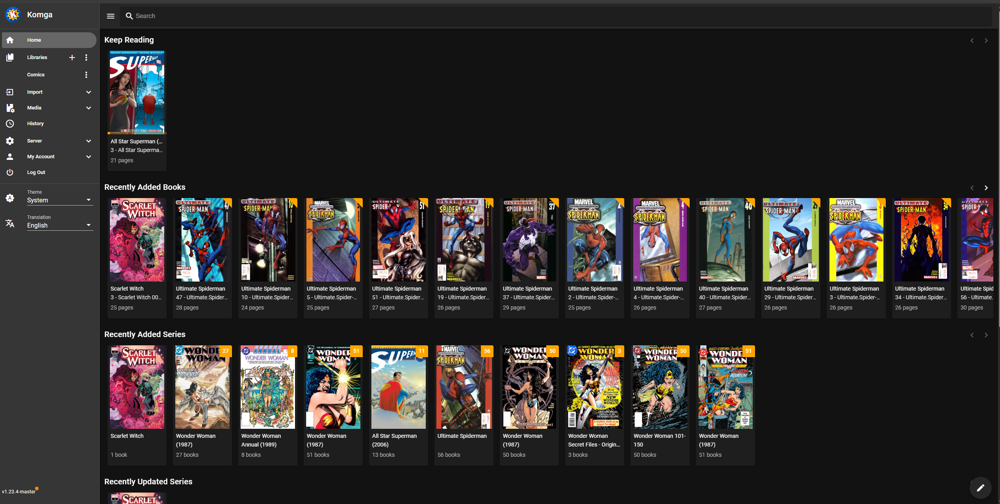

# Self-Hosted Library Automation Stack (Komga + Mylar + LazyLibrarian)

A self-hosted media library automation stack for managing **comics** and **ebooks**, including metadata enrichment, automated processing, and a clean reading experience through a browser-based library server.

This project demonstrates practical skills in **Linux server administration**, **service management**, **networking**, and **automation workflows** across multiple integrated applications.



---

## What this project does

- Centralises **comics + ebooks** into a structured library
- Uses an indexer manager to **search and manage sources**
- Automatically sends downloads to a download client
- Imports and organises completed downloads into library folders
- Enhances libraries with **metadata** (covers, author info, series info)
- Provides a clean UI for browsing and reading content

---

## Stack Overview

| Tool | Purpose |
|------|---------|
| **Komga** | Comic/Manga library server for browsing and reading |
| **Mylar** | Comic automation (search, monitor series, import + rename) |
| **LazyLibrarian** | Ebook automation + metadata management |
| **Prowlarr** | Indexer manager shared across multiple apps |
| **qBittorrent** | Download client used by the automation tools |

---

## Workflow (High Level)

```text
Indexers (via Prowlarr)
        ↓
Mylar / LazyLibrarian (search + monitor)
        ↓
qBittorrent (downloads)
        ↓
Completed Downloads folder
        ↓
Library Import + Rename + Metadata
        ↓
Komga / Kindle-ready library
```

---

## Suggested Folder Structure

This structure keeps downloads separate from final libraries:

```text
/home/<user>/
  Downloads/
    Comics/
    Books/
  Media/
    ComicsLibrary/
    BooksLibrary/
```

Example paths used in my setup:

- Comics downloads: `/home/teresa-fares/Downloads/Comics/`
- (Optional) Books downloads: `/home/teresa-fares/Downloads/Books/`
- Comics library: `/home/teresa-fares/Media/ComicsLibrary/`
- Books library: `/home/teresa-fares/Media/BooksLibrary/`

> Folder paths can be adjusted depending on your server layout.

---

## App Integrations

### Prowlarr → Mylar / LazyLibrarian
Prowlarr acts as the single source of truth for indexers, so apps don’t need separate indexer configuration.

**Benefits:**
- One place to manage indexers
- Easier troubleshooting
- Consistent settings across apps

---

### Mylar / LazyLibrarian → qBittorrent
Both automation apps are configured to send downloads to **qBittorrent**, then monitor the completed downloads folder for importing.

**Key settings to confirm:**
- Download client host + port
- Category tags (optional but recommended)
- Completed download folder access permissions

---

### Komga → Library Folders
Komga reads from the final library folders (not the downloads folder) for a clean library experience.

---

## Access & Security Notes

This stack can be hosted in a few ways depending on your environment:

- **Local-only access** (recommended for simplest security)
- **VPN access**
- **Reverse proxy / secure tunnel** (if remote access is required)

When exposing services externally, recommended best practices include:
- Strong passwords + unique credentials per service
- Restricting access via authentication and/or IP allowlists
- Using HTTPS where possible
- Avoiding direct exposure of download clients

---

## Troubleshooting Highlights

Some common issues I worked through during setup:

### Indexers blocked / access denied
Some indexers may be protected by bot detection or require specific configuration.
Fixes often include:
- Switching to supported indexers
- Ensuring the correct base URL / API settings
- Confirming the indexer works directly inside Prowlarr first

### “No results” or “metadata missing”
Metadata providers sometimes require:
- Enabling the correct metadata sources
- Confirming API keys (where required)
- Matching author/series names correctly

### Permissions / folder access errors
On Linux, automation apps must have read/write permissions to:
- downloads folder
- library folder
- temporary import folders

---

## What I learned

This project helped me build hands-on experience with:

- Linux server setup and troubleshooting
- Application integration (API keys, service linking, download clients)
- Folder permissions and automated file handling
- Networking concepts (local access vs remote access)
- Maintaining a stable, repeatable workflow across multiple services

---

## Future Improvements

- Add Docker Compose deployment for easier portability
- Add monitoring/health checks (service uptime + alerts)
- Add backup strategy for config + library metadata
- Add automated Kindle delivery workflow (email/send-to-device)

---

## Disclaimer

This project is shared for **educational and technical demonstration purposes**, focusing on automation, server administration, and system integration.
