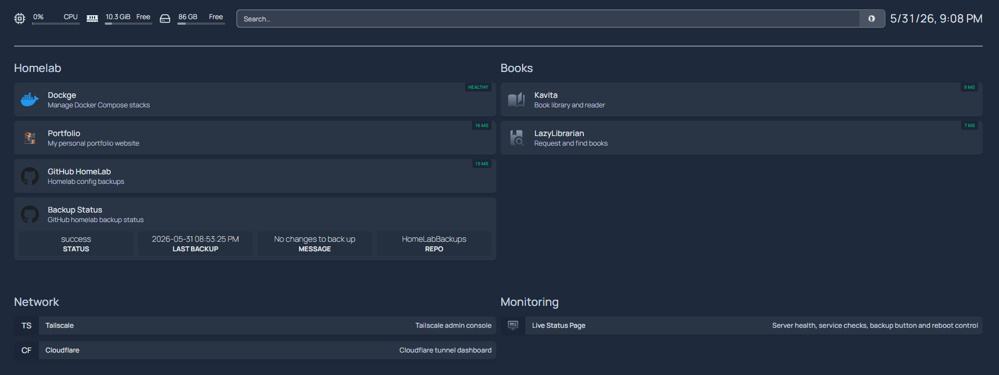
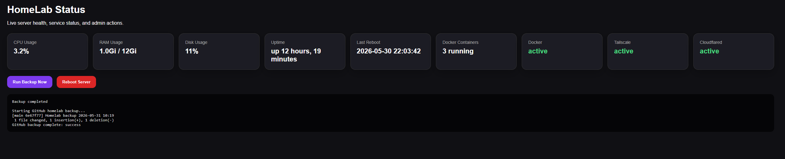

# Teresa's HomeLab

A self-hosted Ubuntu home server project built from scratch to host personal websites, dashboards, Docker apps, backup monitoring, remote-access services, and a personal digital book library.






---

## Overview

This HomeLab runs on an Ubuntu server and provides a central dashboard for the services I host. It includes private remote access, public subdomains, Docker-based apps, a hosted portfolio website, a digital book library, service health checks, and backup status monitoring.

The goal of this setup is to create a reliable personal server environment where I can host projects, test infrastructure ideas, document real troubleshooting work, and build practical IT skills.

---

## What I Set Up

### Ubuntu Server

- Installed and configured Ubuntu Server as the main operating system.
- Connected the server to the network during setup.
- Configured remote access so the server can be managed without needing a monitor or keyboard.
- Set up SSH access for command-line administration.
- Confirmed key services can automatically start again after reboot.
- Used Linux tools such as `nano`, `systemctl`, `docker compose`, SSH, and service logs for administration and troubleshooting.

---

### Remote Access

Remote access was configured so the server can be managed securely from another device.

#### Tailscale

- Installed and configured Tailscale for secure private remote access.
- Used Tailscale to connect to the server over a private VPN-style network.
- Confirmed Tailscale starts automatically after reboot.
- Used the private Tailscale network for local/private access to services.

#### SSH

- Enabled SSH access to the Ubuntu server.
- Used SSH to manage files, services, Docker containers, and configuration remotely.
- Used SSH for troubleshooting service issues, updating configuration files, and checking logs.

---

### Cloudflare Tunnel

Cloudflare Tunnel was configured to expose selected services publicly without opening router ports.

- Installed and configured `cloudflared`.
- Created a systemd service for Cloudflare Tunnel.
- Configured the tunnel to run automatically after reboot.
- Used Cloudflare DNS/subdomains to route public URLs to internal services.
- Troubleshot Cloudflare tunnel issues including local service availability, invalid URLs, and systemd service configuration.

Example service configuration checked:

```ini
[Unit]
Description=cloudflared
After=network-online.target
Wants=network-online.target

[Service]
TimeoutStartSec=15
Type=notify
ExecStart=/usr/bin/cloudflared --no-autoupdate --config /etc/cloudflared/config.yml tunnel run
Restart=on-failure
RestartSec=5s

[Install]
WantedBy=multi-user.target
```

---

### Docker and Docker Compose

Docker was used to run services in containers.

- Installed Docker and Docker Compose.
- Created dedicated folders for different apps.
- Used `docker-compose.yml` files to define services.
- Restarted and checked containers from the terminal.
- Used Docker to host dashboard and app services.
- Used Dockge as a web interface for managing Docker Compose stacks.

Useful commands used during setup:

```bash
docker ps
sudo docker compose up -d
sudo docker compose down
sudo docker compose restart
sudo docker compose logs -f
```

---

## Dashboard

A central dashboard was created to display the hosted services and server-related information.

The dashboard acts as the main landing page for the HomeLab and includes links/status cards for apps, websites, and tools.

### Dashboard Features

- App/service cards.
- Links to hosted services.
- Health/status indicators.
- Backup status card.
- Website card for the portfolio.
- Dockge health card.
- Book library card.
- Clean visual interface for accessing everything from one place.

### Services Added to the Dashboard

- Portfolio website.
- Dockge.
- Kavita book library.
- Backup status.
- Server status/stat cards.
- Other self-hosted services as they are added.

---

## Portfolio Website Hosting

A personal portfolio website was added to the HomeLab.

- Hosted the portfolio on the server.
- Connected the website to the dashboard.
- Fixed server-side display issues where only the CSS gradient was showing.
- Confirmed the website loaded correctly after troubleshooting.
- Added the website as a dashboard card.
- Planned use of the website favicon as the dashboard icon.

---

## Book Library

A self-hosted book library was added so PDFs and other digital books can be stored, organised, and accessed through the HomeLab.

### Kavita

Kavita was set up as the main book library service.

- Deployed Kavita as a self-hosted library app.
- Added Kavita to the HomeLab dashboard.
- Configured a local/private service URL for library access.
- Tested library access from the browser.
- Used Kavita to scan a mounted books folder and display available books.
- Confirmed that books can be added manually by copying files into the library folder.

### Book Storage

Books are stored in a dedicated folder on the server. Kavita reads this folder as a library source.

Example folder structure:

```text
homelab/
└── books/
    ├── Book One.pdf
    ├── Book Two.pdf
    └── Author Name/
        └── Book Three.pdf
```

### Manually Adding Books

Books can be manually copied from a PC to the server and then scanned by Kavita.

Example using `scp` from a PC or WSL terminal:

```bash
scp "C:/path/to/book.pdf" username@server-address:/home/username/homelab/books/
```

Example copying a whole folder of books:

```bash
scp -r "C:/path/to/books/*" username@server-address:/home/username/homelab/books/
```

After copying the books across:

1. Open Kavita.
2. Go to the library settings.
3. Run a library scan.
4. Confirm the new PDFs appear in the library.

### Public/Private Access

The book library can be accessed privately through Tailscale or publicly through a Cloudflare Tunnel subdomain if enabled.

For a public README, private IP addresses, usernames, and exact internal paths should be replaced with examples or placeholders.

Example public URL format:

```text
books.example.com
```

---

## Dockge

Dockge was set up to manage Docker Compose stacks from a web interface.

- Installed Dockge using Docker Compose.
- Confirmed Dockge works locally.
- Connected Dockge to the dashboard.
- Configured a public Cloudflare subdomain for Dockge.
- Troubleshot local and public access issues.
- Confirmed Dockge health status appears on the dashboard.

Example public URL format:

```text
dockge.example.com
```

---

## Backup System

A backup system was configured for the HomeLab.

### GitHub Backup Repository

Backups are pushed to a GitHub repository. For public documentation, repository URLs and tokens should be kept private unless the repository is intentionally public.

Example repository format:

```text
https://github.com/username/repository-name.git
```

### Backup Features

- Created a backup workflow for important HomeLab files.
- Connected the backup system to GitHub.
- Added backup status output to the dashboard.
- Created a status JSON file to display backup information.
- Added a dashboard card showing backup status.
- Tested running backups manually.

### Backup Status

The dashboard was configured to show backup status from a JSON file.

Example status file path:

```text
/status/backup-status.json
```

The backup status card can show information such as:

- Last backup date/time.
- Backup success/failure state.
- Backup destination.
- Repository status.

### Manual Backup Test

Backups can be manually tested from the server using the backup script/command created during setup.

Example workflow:

```bash
cd ~/homelab
./backup.sh
```

---

## System Services and Auto Start

Important services were configured to run automatically after reboot.

Configured services include:

- Tailscale.
- SSH.
- Cloudflare Tunnel.
- Docker.
- Docker containers managed with Docker Compose.
- Dockge.
- Kavita book library.
- Hosted dashboard and website services.

Useful service commands:

```bash
sudo systemctl status cloudflared
sudo systemctl restart cloudflared
sudo systemctl enable cloudflared
sudo systemctl status tailscaled
sudo systemctl status ssh
docker ps
```

---

## Reboot and Service Checks

The server can be rebooted from the terminal:

```bash
sudo reboot
```

After reboot, services can be checked with:

```bash
systemctl status ssh
systemctl status tailscaled
systemctl status cloudflared
docker ps
```

---

## Skills Practised

This HomeLab helped me practise real-world infrastructure and support skills, including:

- Linux server setup.
- Ubuntu Server administration.
- SSH remote management.
- Tailscale remote access.
- Cloudflare Tunnel configuration.
- DNS and public subdomain routing.
- Docker and Docker Compose.
- Docker stack management with Dockge.
- Web hosting.
- Dashboard setup and customisation.
- Self-hosted book library setup.
- Manual file transfer with `scp`.
- Backup automation.
- GitHub repository backups.
- JSON status monitoring.
- Troubleshooting local and public service access.
- Systemd service management.
- Server reboot testing.
- Service health checks.

---

## Technologies Used

- Ubuntu Server
- Linux CLI
- SSH
- Tailscale
- Cloudflare Tunnel
- Docker
- Docker Compose
- Dockge
- Kavita
- GitHub
- HTML
- CSS
- JavaScript
- JSON
- systemd

---

## Current Status

The HomeLab currently has:

- A working Ubuntu server.
- Remote access through Tailscale and SSH.
- Public access through Cloudflare Tunnel.
- A central dashboard.
- A hosted portfolio website.
- A self-hosted Kavita book library.
- Dockge for Docker Compose management.
- GitHub-based backups.
- Dashboard backup status monitoring.
- Services configured to start after reboot.

---

## Future Improvements

Planned improvements include:

- Add more services to the dashboard.
- Add server CPU, RAM, disk, and uptime stats.
- Add more automated health checks.
- Improve backup reporting.
- Add alerting for failed backups or offline services.
- Improve book request/search automation.
- Add automated book metadata management.

---

## Purpose

This HomeLab is a personal learning project that demonstrates hands-on experience with server administration, self-hosting, networking, automation, backups, media/library hosting, and web hosting.

It shows that I can build, troubleshoot, document, and maintain a small infrastructure environment from scratch.
